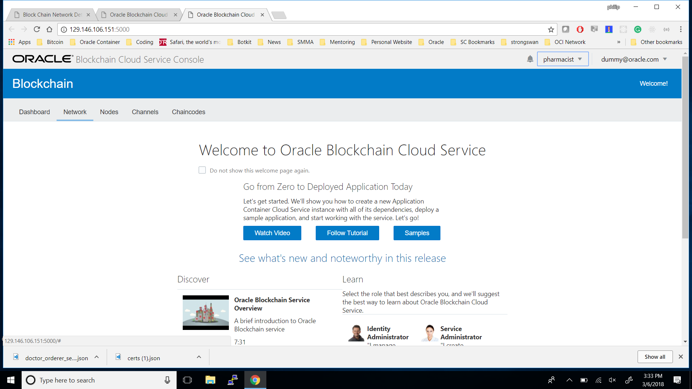

# Hackathon Examples

# High Level Business Case Motivation
## Healthcare blockchain
- In healthcare, HIPAA compliance is extraordinarily important. What we do to ensure that companies can comply is have a two tier system. In one user flow a doctor can add prescriptions to a list that is added to Oracle Blockchain. Because of the technical details of how the blockchain is configured, this ledger is indisputable and 'none-hackable' (or at the very least, very difficult). In another user flow a pharmacist can see the prescriptions that are available to be fulfilled, and fill or deny them. This also alters the blockchain ledger. A third party can then verify that these transactions were performed properly.
## Financial Blockchain
- We have a similar need for an indisputable ledger in finance. In this program I take real time stock data and add it to a blockchain ledger to simulate how a stock exchange might secure its transactions. However the security of transactions in finance generally is hugely important, so this use case can be generalized from everything from options trading to asset backed securities such as mortgages. I then allow a user to "buy" or "sell" stock and add these transactions to the blockchain, only allowing a sale if the user attempts to sell below the exchange price or allow a purchase if the user attempts to buy over the exchange price.
* **Major Caveat!**  The api service I use, *AlphaVantage*, is a real time streaming service that offers free stock market quotes for developers (free stock services are hard to find generally, which is why it is the service we use). It is sometimes under heavy load and, since it is a free service, they're site is not always available because servers are expensive. Because of this, the site may not be available to use at all times! For this reason we are not going to be demoing this application live, but feel free to try it on your own. Visit https://www.alphavantage.co/query?function=TIME_SERIES_INTRADAY&symbol=MSFT&interval=1min&apikey=demo to see if the API endpoint the program calls is active. If you get a JSON return, it's good to go!

# 🙃 Now the fun part 🎉 *Oracle BlockChain* ⛓🔥

## GUI Walkthrough
- In these first steps we will be walking through how to use the Oracle GUI to create a Hyperledger Fabric network and upload a chain code file. We will then connect the network to our backend service so they backend can make API calls against the chaincode. There are a lot of steps, but *don't worry!* We did this on purpose so that each step through of the GUI can be easily explained with baby steps. While reading this through later feel free to skim.

BLOCKCHAIN=
DOCTOR_PORT=
PHARMACIST_PORT=
CHANNEL=
CHAINCODENAME=
CHAINCODEVER=

--------

- Navigate to *http://your-ip-address:3000/provision.html* to gain access to the GUI. The ip address should be provided to you from a proctor.
--------

--------

- Click *Create Block Chain Network*.
--------

--------

- Fill in the network as show. The ip address should be the same as the one in the address bar. We will need **REST PROXY PORT** so make a note of it. When we go to connect our backend this will be the **DOCTOR_PORT** in the `.env` file. The ip address will be the **BLOCKCHAIN** field in our environment file.
--------

--------

- Click apply and then ok at the prompt.
--------

--------

- We are going to want to manage the doctor network, so when it shows in the sidebar on the left, click it. It will prompt you; hit ok and it will pop the network in another tab.
--------

--------

- Now click *Create Block Chain Organization*.
--------

--------

- Fill it out as shown. Again the ip address is the ip address in the address bar. Make a note of the **REST PROXY PORT** as this will now be our **PHARMACIST_PORT** in our backend `.env` file.
--------

--------

- Click ok at the prompt after hitting apply.
--------

--------

- From the sidebar click pharmacist to pop the network in another tab, clicking here on the prompt.
--------

--------

- Inside the pharmacist tab click the drop down and *Export Certificate*.
--------

--------

- Inside the doctor tab we are going to navigate to the *Network Tab* and click the blue *Add Organization* button. In the field select *pharmacist* and upload the certificate you just downloaded. This allows the doctor network to know that the pharmacist network is cool with connecting.
--------

--------

- You should see the pharmacist as a field in your network now. Click the hamburger menu to the far right of the doctor *Organization ID* and click *Download Admin Credentials*. We are doing the same thing for the doctor as we just did for the pharmacist - getting the credentials to send to the pharmacist, but with the doctor being the administrator node of the network.
--------

--------

- Go back to the pharmacist tab.
--------

--------

- Navigate to the network tab.
--------

--------

- Click the *Import Orderer Settings* button and upload the credentials file that we just downloaded.
--------

--------

- Now navigate to nodes.
--------

--------

- Click *Export/Import* and then *Export*.
--------

--------

- Export the two peer nodes. Now that the two networks have each others credentials, we are exporting the pharmacists nodes to the master node of the doctor.
--------

--------

- Go to the nodes section in the doctor window tab.
--------

--------

- Click *Export/Import* and then *Import*.
--------

--------

- Import the nodes that were exported by the pharmacist.
--------

--------

- You should now see a pharmacist node appearing in the doctor node window pane!
--------

--------

- Go to channels.
--------

--------

- Create a channel name that the doctor and pharmacist will communicate over. Make a note of this name as it will exist in **CHANNEL** in our `.env` file.
--------

--------

- Navigate to the pharmacist window pane and then nodes.
--------

--------

- Click the hamburger menu of *peer0.pharmacist.com* and then *Edit* to bring you to this window.
--------

--------

- Click joined channels.
--------

--------

- Join the channel you just made in doctor!
--------

--------

- Go to channels tab.
--------

--------

- If you click the ledger item for the channel you made you can see where the common ledger is across all the peers. **WHEN PEOPLE TALK ABOUT A DISTRIBUTED LEDGER THIS IS THAT LEDGER GETTING ALL DISTRIBUTED AND STUFF**. This is the area where you can see new items getting populated to chaincode when you push entries from the backend of your REST service.
--------

--------

- Here is the joined peers tab where you can see that the doctor peer has joined. If it hasn't already been set, you need to set the doctor peer as the anchor peer, first by selecting the doctor peer and then clicking on *Set Anchor Peer*.
--------

--------

- In the pharmacist tab you need to go to *Channels*, and then *Joined Peers*. You need to make sure that the anchor peer is *peer0.pharmacist.com* if the menu is not already pre-populated.
--------

--------

- In the doctor window pane go to *Chaincodes*.
--------

--------

- Here is cool part where we upload our chaincode, the *golang* server logic that operates the blockchain. Later on if you want to deep dive into how chaincodes work you can learn *golang* and write your own, but we've made a simple one for this example. It exists in the *chaincode* folder at root of this directory if you want to check it out - that's the one we are now going to upload. We give our chaincode a name which we note to include in our `env` file as **CHAINCODENAME**, and as version we will just put down `v1` (this is **CHAINCODEVER** in our `env` file). Our targeted peers are *peer0.doctor.com* as it is our master node. We upload a zipped version of our `.go` chaincode file and then push the *install* button.
--------

--------

- The chaincode name should appear in a menu in the *Chaincodes* tab, click it to get to this window. Click the hamburger menu to the right of the version number as shown and click *instantiate* from the drop down menu.
--------

--------

- Format the resulting menu as shown. While before the chaincode had been installed on the network, this tells the network to take targetted peers and actually start running it.
--------

--------

- Just as we did on the doctor network we need to go to the *Chaincodes* tab of the pharmacist window pane and install the chaincode, keeping the same name, version number, and uploaded file.
--------

--------

- Now go to the doctor window pane and the *Nodes* tab. Click to edit the *Rest proxy gateway* as shown.
--------

--------

- Make sure to expose the chaincode on the channel as shown.
--------

--------

- Highlight the gateway we just edited and the click the third grey icon menu from the buttons above the table. Click ok to restart the gateway - this isn't always necessary, but is sometimes to have the changes take effect.
--------

--------

- Go to the pharmacist window pane and edit it's gateway similarly.
--------

--------

- What the menu should look like.
--------

--------

- And similarly restart.
--------

# *Important Last Step*
- We need to link our blockchain network credentials with our backend service, so the two can pass information.
- We have an environment file `.env` located at `/Healthcare Example/BACKEND/.env`. There are currently empty credentials in there, as you should never put your server credentials on a public github repository.
- Take all the names you wrote down as you built your network where noted above and put them into your `.env` file.

# Running Program Locally and Pushing to Application Contain Cloud Service
- To walkthrough the requirements to start these programs and push the backend code to Oracle Application Container Cloud Services please continue reading. We will be following along with testing and uploading the healthcare application, but the finance application is available to experiment with on your own.

# What is here and what are we doing?
## What's here?
- There are two different folders here, both an example of using a blockchain on Oracle Blockchain service. There is a Finance Example and a Healthcare Example. The finance example folder contains a frontend in React, a javascript framework, and a backend in Golang. It shows an example of how to add information from a stock API service (http://www.alphavantage.com) to a blockchain, add real time price information to the blockchain, and how to add buy and sell data from you, the user, and add that to the block chain. The health care example has a frontend in React, and a backend in Node.js. The healthcare example has a doctor page and a pharmacist page. A doctor can add prescriptions to the blockchain and a pharmacist can retrieve and fill those prescriptions.
## What are we doing?
- This README file will show you how to load these files to Application Container Cloud Service, a software as a service (SaaS) platform that pipelines code to the cloud. The following steps are broadly similar to those outlined here (http://www.oracle.com/webfolder/technetwork/tutorials/obe/cloud/apaas/go/getting-started-go-accs/getting-started-go-accs.html) for the finance application and here (http://www.oracle.com/webfolder/technetwork/tutorials/obe/cloud/apaas/node/getting-started-node-accs/getting-started-node-accs.html) for the health care application, but slightly more tailored for our use case. Important thing to note: we are only going to push the backend portion to ACCS, our frontend we will continue to run on localhost.

# First Things First
## Let's run these apps.
- To run the healthcare application in from localhost (your localmachine), first make a terminal window and `cd` into the `FRONTEND` folder. Type `npm install` enter, and then `npm start`. This should start the frontend of the application, however we also need to start the backend. The next step is to `cd` into the `BACKEND` folder, and follow the same steps (as they are both javascript applications); `npm install` followed by `node app.js`.
- To run the finance application you can do the same for the frontend, `cd FRONTEND` and then `npm install` then `npm start`. For the backend, after `cd BACKEND`, `cd src` and `./start.sh`. The `start.sh` file is a bash script that executes terminal commands after being run (pretty sweet). If you'd like to know more about how Golang is compiling and being run you can take a look in the `start.sh` file and try the steps manually in your terminal.

# Pushing to Application Container Cloud Services

## Healthcare Application
### First zip your files
- First thing that we have to do is take our backend files and create a zip. In your file explorer navigate to the `BACKEND` folder, select `app.js`, `manifest.json`, `package-lock.json`, and `package.json` and zip them according to how your operating system is configured (in varies on macOS and Windows computers).
### The next steps are largely similar to what is available in the Oracle Documentation.
- Log in to Oracle Cloud at (http://cloud.oracle.com/) with the credentials provided for you by your hackathon mentors.
- In the Oracle Cloud Services dashboard, click the Action menu Menu, and select Oracle Application Container Cloud Service.
- To open the Oracle Application Container Cloud Service console, click Services.
- In the Applications list view, click Create Application and select Node.
- In the Application section, enter a name for your application and click Browse.
- On the File Upload dialog box, select the name of the zip file you created in your file explorer and click Open.
- Keep the default values in the Instances and Memory fields and click Create.
- Wait until the application is created. The URL is enabled when the creation is completed.
### Now one more thing!
- We have zipped and pushed our backend files to the cloud. We now need to make sure that our APIs can point to the backend. Luckily we have an `env.json` file that contains the API root that we are going to use.  Navigate to the root of `FRONTEND` to find the `env.json` file. Copy the path of the url that you created in the previous section into this this file where the current path name exists in quotes. Now you can `npm start` to restart your server and you are now accessing ACCS!

- More documentation here: (http://www.oracle.com/webfolder/technetwork/tutorials/obe/cloud/apaas/node/getting-started-node-accs/getting-started-node-accs.html)

## Finance Application
### IMPORTANT NOTE
- If you have not yet downloaded and installed the Go language made by Google, you will need to do so if you would like the `BACKEND` to compile on your local machine. If you do not want to do so, that is OK, pushing to ACCS and compiling there should still work. Information about downloading and install the Go programming language can be found here (https://golang.org/dl/).
### First zip your files
- First thing that we have to do is take our backend files and create a zip. In your file explorer navigate to the `BACKEND/src` folder, select `backendBLOK`, `github.com`, `golang.org`, `manifest.json`, and `start.sh` and zip them according to how your operating system is configured (in varies on macOS and Windows computers).
### The next steps are largely similar to what is available in the Oracle Documentation.
- Log in to Oracle Cloud at (http://cloud.oracle.com/) with the credentials provided for you by your hackathon mentors.
- In the Oracle Cloud Services dashboard, click the Action menu Menu, and select Oracle Application Container Cloud Service.
- To open the Oracle Application Container Cloud Service console, click Services.
- In the Applications list view, click Create Application and select Node.
- In the Application section, enter a name for your application and click Browse.
- On the File Upload dialog box, select the name of the zip file you created in your file explorer and click Open.
- Keep the default values in the Instances and Memory fields and click Create.
- Wait until the application is created. The URL is enabled when the creation is completed.
### Now one more thing!
- We have zipped and pushed our backend files to the cloud. We now need to make sure that our APIs can point to the backend. Luckily we have an `env.json` file that contains the API root that we are going to use. Navigate to the root of `FRONTEND` to find the `env.json` file. Copy the path of the url that you created in the previous section into this this file where the current path name exists in quotes. Now you can `npm start` to restart your server and you are now accessing ACCS!

- More documentation here: (http://www.oracle.com/webfolder/technetwork/tutorials/obe/cloud/apaas/go/getting-started-go-accs/getting-started-go-accs.html)
